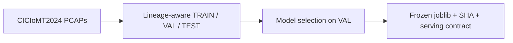

# IoMT intrusion detection from raw PCAPs

End-to-end IoMT intrusion detection system that converts raw network PCAPs into deterministic packet-window features, scores them with a frozen HistGradientBoosting model, and serves PCAP-level BENIGN/ATTACK predictions through a Dockerized FastAPI service deployed on Google Vertex AI.

CICIoMT2024 is a **benchmark** for IoMT traffic classification. The authors themselves identify deployability, real-time evaluation, and efficiency as work beyond that benchmark. This repository takes the raw-PCAP corpus toward an actual serving system: lineage-aware TRAIN/VAL/TEST, a frozen model, a serving contract, and a cloud endpoint that scores PCAPs from GCS.

Research chronology (Phase 1/2), CLI commands, and freeze tables live in [docs/RESEARCH_AND_DEVELOPMENT.md](docs/RESEARCH_AND_DEVELOPMENT.md). Cloud identities and runbooks: [docs/DEPLOYMENT.md](docs/DEPLOYMENT.md).

## Architecture

**Online (inference)**

```mermaid
flowchart LR
  PCAP[Raw PCAP] --> GCS[GCS input bucket]
  GCS --> EP[Vertex AI Endpoint]
  EP --> CTR[Custom Docker container]
  CTR --> DPKT[DPKT parser]
  DPKT --> WIN["25-packet windows"]
  WIN --> FE["27-feature extractor"]
  FE --> SEL["Ordered 22-feature selector"]
  SEL --> HGB[Frozen HGB]
  HGB --> TH[Threshold]
  TH --> AGG[PCAP aggregator]
  AGG --> OUT["BENIGN / ATTACK"]
```



**Offline (training / freeze)**



Parser, windows, features, model, threshold, and aggregation are **frozen** for V1. Changing any of them is a new serving contract.

## Headline results (held-out TEST)

| Metric | Value |
| --- | --- |
| Aggregate attack recall | **99.826%** |
| Benign FPR | **0.07915%** |
| TEST windows | 6,206,674 across 29 PCAPs |
| Confusion (windows) | TP 6,180,714 / TN 15,149 / FP 12 / FN 10,799 |

**V1 is not a comprehensive IoMT detector.** It is strongest on DDoS, DoS, MQTT flooding, and most Recon. Weak families on the same TEST set:

| Weak family | TEST recall |
| --- | --- |
| ARP spoofing | 8.02% |
| MQTT malformed | ~22.92% |
| Recon VulScan | 40.34% |

Those gaps are expected from the training mix (spoofing is ~0.007% of TRAIN windows) and from the nontemporal 22-feature subset. Do not treat V1 as a general-purpose medical-device IDS.

Full family tables: [`data/modeling/v1/V1_ASSESSMENT.md`](data/modeling/v1/V1_ASSESSMENT.md).

## Technology stack

| Layer | Choice |
| --- | --- |
| Packet parse | DPKT, Ethernet (`DLT_EN10MB=1`) only |
| Features | 27 extracted → 22 nontemporal, ordered |
| Model | sklearn `HistGradientBoostingClassifier` **== 1.9.0** |
| API | FastAPI + Uvicorn, `/health` + `/predict` |
| Local container | Docker `linux/amd64` |
| Cloud | Artifact Registry, Vertex AI Model Registry + Endpoint, GCS |
| Runtime SA | `iomt-predictor@…` (objectViewer on the input bucket) |

Frozen artifact SHA:

`c07ef4088cd44523787c041db449f64429328c0a42b76dfe14de3697cbea77bb`

Release container (`linux/amd64`):

`us-west1-docker.pkg.dev/iot-pcap-pipeline/iomt-serving/iomt-ids@sha256:68ea9a9a251cba9bdad1862ff1a90ef6947495fd1c02ce3fed3bcdb085564752`

Scores are **uncalibrated** ranking values. The JSON field is `score` / `window_attack_score`, never `probability`.

## Demo

The live Vertex endpoint is **not** kept running for demos (idle replicas cost money). Proof of a successful cloud call is the sanitized screenshot below plus [`data/serving/v1/d4_vertex_complete.json`](data/serving/v1/d4_vertex_complete.json). Redeploy with [docs/DEPLOYMENT.md](docs/DEPLOYMENT.md) and `scripts/vertex_smoke.py`.

**Request** (Vertex `rawPredict` body):

```json
{
  "instances": [
    {
      "gcs_uri": "gs://iomt-pcap-input-<PROJECT_NUMBER>/pcaps/example.pcap"
    }
  ]
}
```

**Response** (PCAP-level; one prediction per request):

```json
{
  "predictions": [
    {
      "status": "OK",
      "prediction": "ATTACK",
      "pcap_attack_score": 1.0,
      "window_summary": {
        "total_windows": 4,
        "attack_windows": 4,
        "benign_windows": 0
      },
      "decision": {
        "window_attack_threshold": 0.9490790963172913,
        "minimum_complete_windows": 3,
        "pcap_min_attack_windows": 3,
        "pcap_attack_rate_threshold": 0.005
      },
      "model": {
        "model_version": "v1_hgb22_nontemporal",
        "serving_contract_version": "v1",
        "score_semantics": "uncalibrated_model_score"
      }
    }
  ]
}
```


Local file (no HTTP):

```bash
uv run iot-pcap-pipeline classify-pcap path/to/capture.pcap
```

Local HTTP with a directory standing in for GCS (same allowlist rules as production):

```bash
uv sync --extra serving
IOMT_PCAP_FETCHER=local IOMT_LOCAL_PCAP_ROOT=./fixtures \
  IOMT_INPUT_BUCKET=iomt-input IOMT_INPUT_PREFIX=pcaps/ \
  uv run uvicorn iot_pcap_pipeline.api.app:app --host 127.0.0.1 --port 8000 --workers 1
curl -sS -X POST http://127.0.0.1:8000/predict \
  -H 'Content-Type: application/json' \
  -d '{"instances":[{"gcs_uri":"gs://iomt-input/pcaps/object.pcap"}]}'
```

## Quick start (local)

Requires Python 3.11+, [uv](https://docs.astral.sh/uv/), and the frozen `artifacts/v1/H0_full_fit.joblib`.

```bash
uv sync --extra serving
uv run pytest -q
uv run iot-pcap-pipeline --help
```

Docker (Apple Silicon hosts **must** use `--platform linux/amd64`):

```bash
docker build --platform linux/amd64 -t iomt-ids:v1-amd64 .
docker run --rm --platform linux/amd64 -p 8080:8080 iomt-ids:v1-amd64
```

## Repository layout

| Path | Role |
| --- | --- |
| [`src/iot_pcap_pipeline/`](src/iot_pcap_pipeline/) | Parser, features, CLI, serving |
| [`data/modeling/v1/`](data/modeling/v1/) | Frozen model card, TEST metrics |
| [`data/serving/v1/`](data/serving/v1/) | D0–D4 serving records |
| [`docs/RESEARCH_AND_DEVELOPMENT.md`](docs/RESEARCH_AND_DEVELOPMENT.md) | Phase 1/2 chronology |
| [`docs/DEPLOYMENT.md`](docs/DEPLOYMENT.md) | GCP runbook |
| [`LICENSE`](LICENSE) | Code license (MIT) |
| [`NOTICE`](NOTICE) | Dataset / model-artifact provenance |

CICIoMT2024 PCAPs are **not** in git. The small frozen V1 `.joblib` is tracked under `artifacts/v1/` for reproducible serving; it is a derived artifact, not MIT-licensed source. See [NOTICE](NOTICE).

## License and citation

Source code: MIT ([LICENSE](LICENSE)). Dataset, derived features, and the trained model are **not** MIT — they remain under CIC / University of New Brunswick terms (citation required). Cite CICIoMT2024 if you use the data or the frozen detector; see [CITATION.cff](CITATION.cff).
